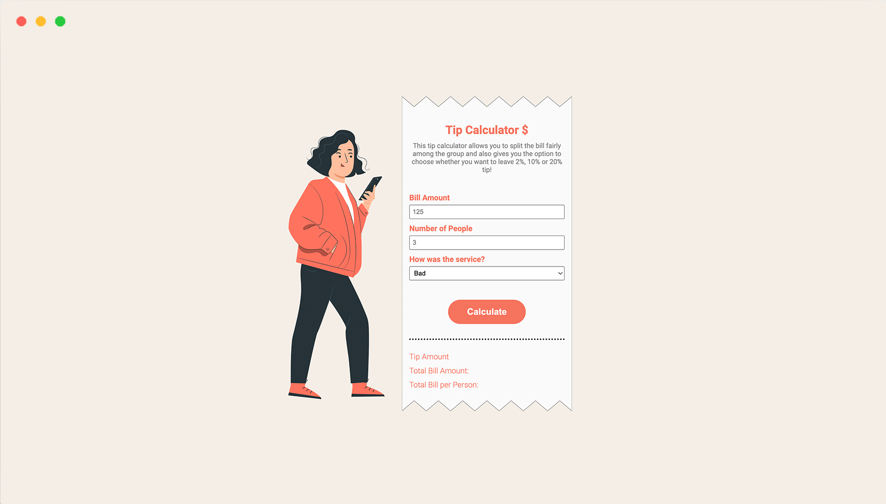

# Tip Calculator created with JavaScript

This tip calculator allows you to split the bill fairly among the group and also gives you the option, depending on the service, to choose whether you want to leave 2%, 10% or 20% tip.

## Demo

Desktop only!
https://cinalselin.github.io/tip-calculator/

## License

Illustrations by freepik
<a href='https://www.freepik.com/vectors/buy'>Buy vector created by storyset - www.freepik.com</a>

## Screenshots

